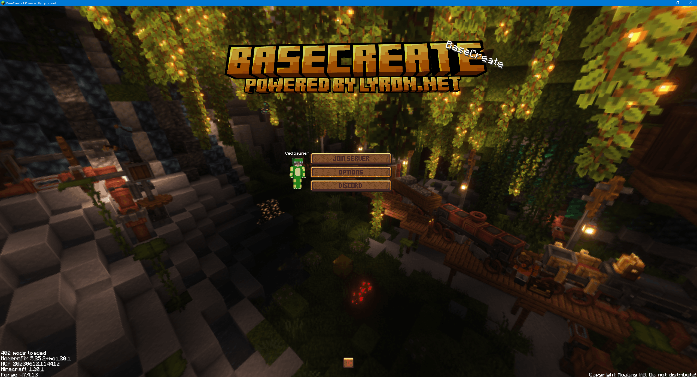

  

<h1 align="center">BaseCreate</h1>

  <a href="https://discord.gg/FhtAhGRmMu">Join the Discord</a>

  A large-scale Create-focused modpack built around automation, factories,
  and recursive engineering systems.

  
  
  
  

---

## About the Pack

**BaseCreate** brings together nearly every major **Create** addon into one cohesive modpack.
The focus is on **automation**, **factory building**, and **mechanical systems that scale over time**.

This pack is made for players who enjoy:
- Building large Create factories
- Designing efficient production chains
- Trains, logistics, and infrastructure
- Long-term worlds with depth and complexity

  

---

## Features

- Complete Create ecosystem with extensive addon coverage  
- Deep automation and logistics gameplay  
- Trains, factories, power systems, and infrastructure  
- Performance and stability mods included  
- Gameplay centered entirely around Create

---

## Installation (Players)

### Recommended: Prism Launcher / MultiMC
1. Download the **BaseCreate (Prism and everytihn else) ZIP** from the Releases page  
2. Open Prism Launcher or MultiMC  
3. Click **Add Instance** → **Import**  
4. Select the downloaded ZIP  
5. Launch and play

### Modrinth
1. Download the **BaseCreate (Modrinth) mcrpack** from the Releases page  
2. Open Modrinth  
3. Doubble click the file.  
4. Modrinth should open.  
5. Launch and play

### CurseForge
1. Download the **BaseCreate (CurseForge) ZIP** from the Releases page  
2. Open CurseForge  
3. Click **Import** → **Import Profile .zip**  
5. Select the downloaded ZIP  
6. Launch and play

### Manual Installation
1. Install **Minecraft Forge 1.20.1**  
2. Download the **BaseCreate (Prism and everytihn else) ZIP** form the Releases page
3. Extract the contents into your Minecraft instance folder  
4. Make sure the following folders exist:
   - `mods`
   - `config`
   - `defaultconfigs`
   - `kubejs`
5. Launch Minecraft with the Forge profile

### Requirements
- **Minecraft:** 1.20.1  
- **Loader:** Forge  
- **RAM:** 6–10 GB recommended  

---

  

## License

This project is licensed under the **MIT License** for all original content
such as configuration files, scripts, and documentation.

All included mods remain the property of their respective authors
and are distributed under their own licenses.
